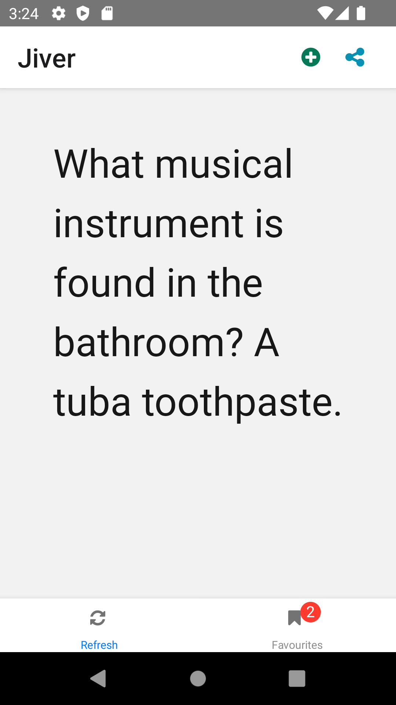
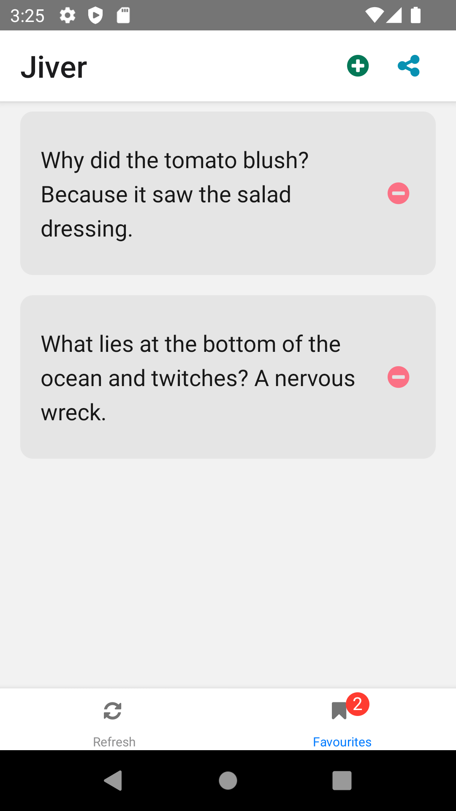

# jokeapp

a small app to request a joke from [iCanHazDadJoke](https://icanhazdadjoke.com)

| Random                                               | Favorites                                               |
| ---------------------------------------------------- | ------------------------------------------------------- |
|  |  |

## analysis

### requirements

- random joke in big font
- action button to add/remove favourites
- action button to share joke
- bottom buttons to sync and view favourites
- favourites a card list

## design

### architecture

- uncle bob's clean architecture, and domain driven design
- separation of concerns
- Dependency injection
- redux architecture
- RTK query instead of fetch

## implementation

### project layout

#### clean architecture modules

- **application**: storage and use cases, binding layers
- **domain**: business entities, interfaces, business critical logic
- **infrastructure**: implementation of repositories, data sources and mapping to domain
- **presentation**: presentation of data and user interaction

### tests

- rules and/or injection to handle threading and coroutines
- fake data generator
- mocking and mock network server
- in-memory database
- user interface tag verifications

## maintenance

### TODO

- [ ] improve UX
- [ ] ML to know sentiment of joke and predict favorites
- [ ] speech bubble characters based on category or sentiment
- [ ] abstract to project template
- [ ] add more remote sources for all the jokes
- [ ] export to text-over-photo for sharing
- [ ] analytics
- [ ] allow user to add content
- [ ] theme switcher
- [ ] device home screen widget
- [ ] splash screen and logo
- [ ] Text-to-speech, laugh track
- [ ] Animations
- [ ] Monetize user customizations
- [ ] security analysis
