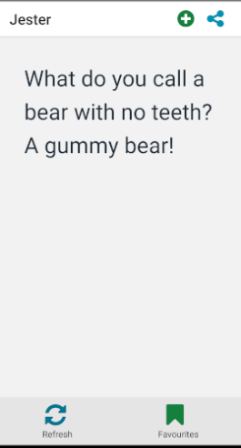

# jokeapp

a small app to request a joke from [iCanHazDadJoke](https://icanhazdadjoke.com)

## design

### architecture

- joke data model and network fetch
- redux to store favourites and current joke
- redux async persistence for favourites
- react navigation

### tests

- TODO

### ui

- random joke in big font
- action button to add/remove favourites
- action button to share joke
- bottom buttons to refresh and view favourites
- favourites is a card list with back button
- native base and vector icons

## incomplete

- share button
